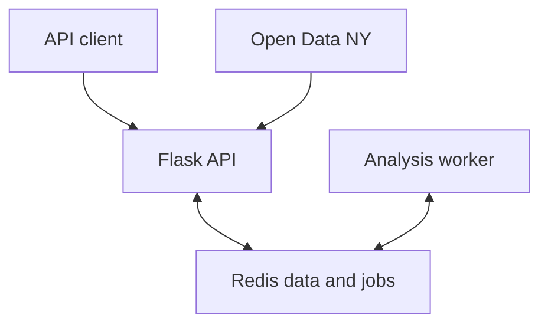

# Distributed Gas Price Platform

[](https://github.com/ni-da-ba/distributed-gas-price-platform/actions/workflows/ci.yml)

A containerized Flask API and asynchronous worker for exploring weekly gasoline prices
across New York State regions. The system ingests the official Open Data NY dataset,
normalizes observations into Redis, serves regional and time-window queries, and runs
descriptive-statistics and linear-trend jobs outside the request path.

This is an independently written portfolio reconstruction of a jointly developed 2024
university project. See [AUTHORS.md](AUTHORS.md) for the exact authorship boundary.

## What it demonstrates

- A versioned JSON API with validation and explicit HTTP failure modes
- Redis-backed data storage, durable job metadata, and queue coordination
- A separately deployable worker for asynchronous numerical analysis
- Reproducible local deployment with Docker Compose
- Kubernetes Deployments, Services, probes, resource limits, and non-root security contexts
- Deterministic unit/API/worker tests and static deployment-contract checks
- CI validation across Python 3.11 and 3.12 plus a full API/Redis/worker Compose smoke test

## System shape



The API and worker share storage, not application control flow. They can be deployed and
scaled independently. See [docs/architecture.md](docs/architecture.md) for failure and
fidelity limits.

## Quick start

```bash
docker compose up --build -d
curl http://localhost:8000/health/ready
curl -X POST http://localhost:8000/v1/data/refresh
curl http://localhost:8000/v1/regions
```

Query a region and create an asynchronous analysis job:

```bash
curl 'http://localhost:8000/v1/prices?region=albany&start=2024-01-01&end=2024-12-31'

curl -X POST http://localhost:8000/v1/jobs/region-analysis \
  -H 'Content-Type: application/json' \
  -d '{"region":"albany","start":"2024-01-01","end":"2024-12-31"}'

curl http://localhost:8000/v1/jobs/<job-id>
curl http://localhost:8000/v1/jobs/<job-id>/result
```

The refresh route contacts the State of New York's [Gasoline Retail Prices Weekly Average
by Region](https://data.ny.gov/d/nqur-w4p7) dataset. Tests use a local fixture and never
depend on the live service.

Stop the local stack with `docker compose down`. Add `-v` only when you deliberately want
to delete the Redis volume.

## API surface

| Method | Route | Purpose |
|---|---|---|
| `GET` | `/health/live` | Process liveness |
| `GET` | `/health/ready` | Redis readiness |
| `POST` | `/v1/data/refresh` | Atomically replace observations from Open Data NY |
| `GET` | `/v1/regions` | List normalized region identifiers |
| `GET` | `/v1/prices` | Query one regional series by optional date range |
| `GET` | `/v1/summary` | Compute synchronous descriptive statistics |
| `POST` | `/v1/jobs/region-analysis` | Queue statistics and trend analysis |
| `GET` | `/v1/jobs` | List job metadata |
| `GET` | `/v1/jobs/{id}` | Read job status |
| `GET` | `/v1/jobs/{id}/result` | Read a completed result |

All errors use `{"error":{"code":"...","message":"..."}}`. Date parameters use ISO
`YYYY-MM-DD`. Region identifiers are lowercase slugs such as `albany`, `new-york-city`,
and `new-york-state`.

## Local development

```bash
python -m venv .venv
source .venv/bin/activate
python -m pip install -e '.[dev]'
ruff check .
ruff format --check .
pytest --cov=gas_price_platform --cov-report=term-missing
```

The Kubernetes base is in `deploy/k8s/base` and renders with:

```bash
kubectl kustomize deploy/k8s/base
```

The base references `ghcr.io/ni-da-ba/distributed-gas-price-platform:1.0.1`.
Release tags matching `vX.Y.Z` publish the corresponding `X.Y.Z` image and
`latest` to GitHub Container Registry with build provenance and an SBOM. See
[deploy/k8s/README.md](deploy/k8s/README.md) for local-cluster and verification
instructions. Use an immutable digest rather than a mutable tag for a real
production rollout. The manifests intentionally contain no credentials.

## Scope

This repository demonstrates application architecture and deployment configuration; it does
not claim to be a production-operated public service. The linear trend is descriptive and
must not be interpreted as a price forecast. The supplied Redis deployment is ephemeral, and
the compact Redis list queue provides at-most-once delivery after a worker removes a job ID;
production use would require leases, acknowledgement, retries, and dead-letter handling.

The current `main` branch is the supported portfolio version. Dependency updates are proposed
automatically, sensitive reports should follow [SECURITY.md](SECURITY.md), and the repository
is released under the [MIT License](LICENSE).
